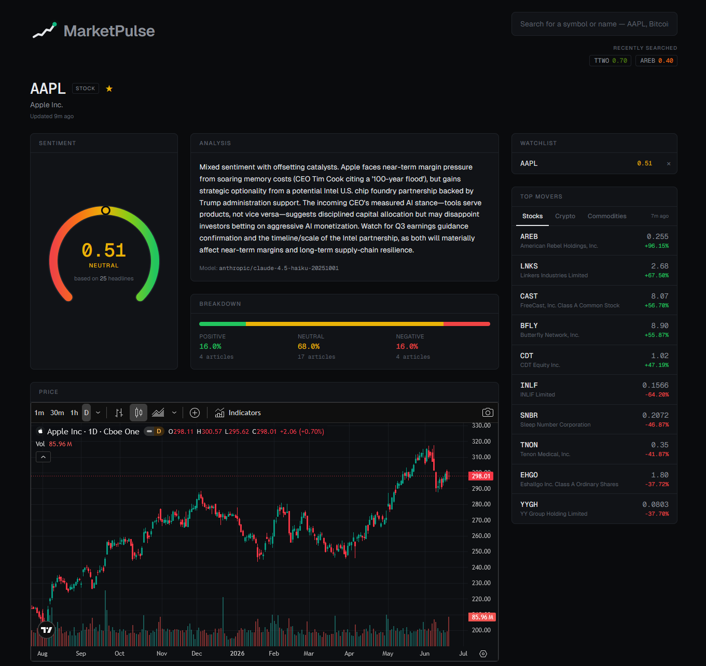

# [marketpulse.fyi](https://marketpulse.fyi)

**News-driven sentiment analysis for stocks, crypto, and commodities.**

MarketPulse reads the latest headlines for any ticker, uses a sentiment pipeline to score each
one by its likely impact on the share price and distills them into a single, confidence-weighted
reading. All wrapped in an animated dark interface with live market
movers, watchlists, and price charts.

## Tech stack

| Layer | Stack |
|---|---|
| **Frontend** | Next.js 14 (App Router), TypeScript, Tailwind CSS, Framer Motion |
| **Backend** | FastAPI (async), SQLAlchemy + asyncpg, PostgreSQL, httpx |
| **AI** | OpenRouter - Claude Haiku 4.5 (primary) + open-model fallback |
| **Data** | Finnhub, Financial Modeling Prep, CoinGecko, TradingView charts |
| **Infra** | Railway (API + Postgres), Vercel (frontend) |

Built by Neil Khetia
